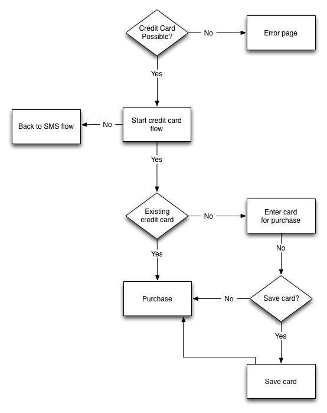

.. _flow:

=======================
End To End Payment Flow
=======================

This page covers the payment flows for the whole process. These exist to explain to other payment processors how the whole payment flow works. Please note that these flows will vary depending upon the payment provider capabilities. Things that will affect the flow are inlcuded but not limited to:

* If the payment provider supports operator billing
* If the payment provider supports credit card
* If the payment provider supports and remembers an identity from the
  marketplace

Step 1: Click Buy
-----------------

User clicks buy, JWT is prepared and the payment flow starts.

Step 2 (if required): Firefox Account Login
-------------------------------------------

User authenticates using Firefox Accounts.

Step 3: PIN
-----------

User creates or enters PIN.

Step 4: Start Payment
---------------------

Payment starts.

.. image:: diagrams/buy-flow-part-four.png

Step 5: Carrier billing
-----------------------

Attempt to identify phone on the carrier. Will use header enrichment
or SMS.

.. image:: diagrams/auth-flow.png

Step 6: Credit card
-------------------

User chooses credit card or returns to carrier billing.

