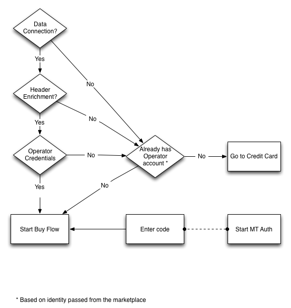
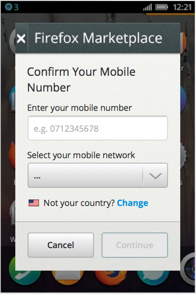
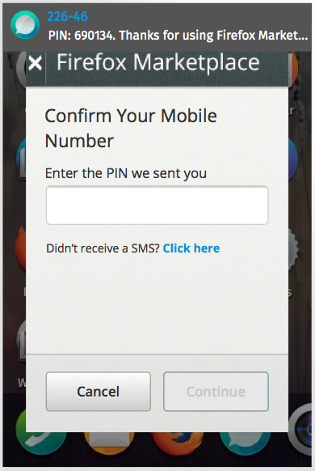
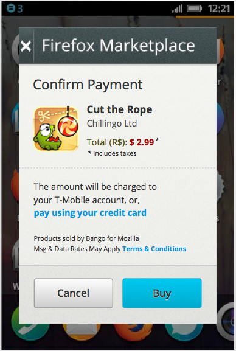
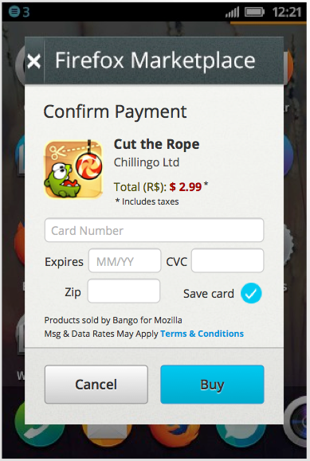
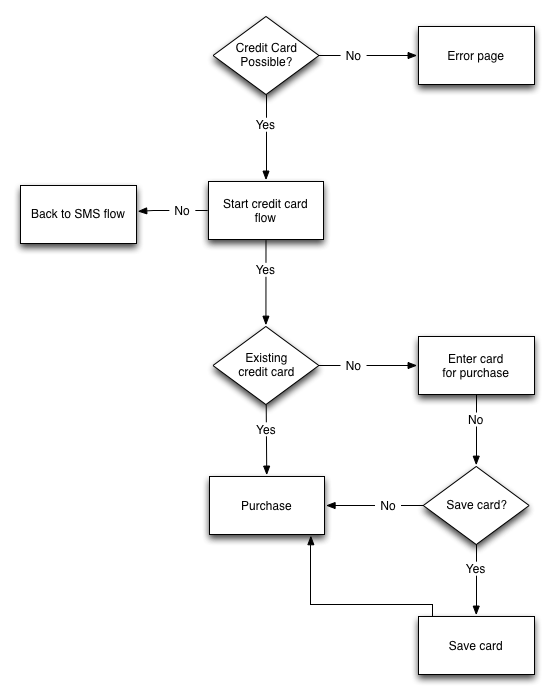

.. _payment-label:

Payments
========

The actual payment screens are hosted by the payment provider. This API starts
a transaction and returns a token. That token is then used to start the
transaction.

.. _transactions:

Transactions
------------

This API enables you to begin a transaction so that a product can be purchased.

.. http:post:: /transactions

    **Request**

    :param price:
        Decimal amount of the purchase price. Example: ``0.99``.
    :type price: decimal

    :param currency:
        ISO currency code for the purchase price. Examples: ``EUR``, ``USD``.
    :type currency: string

    :param carrier:
        Mobile carrier that the user is on when making a purchase.
        Example: ``TMOBILE``.
    :type carrier: string

    :param region:
        Numeric MCC (Mobile Country Code) of the region that the user is in
        when beginning the transaction. Example: ``300``.
    :type region: string

    :param success_url:
        Fully qualified URL to where Zippy should redirect to after a successful
        payment. Example: ``https://marketplace.firefox.com/mozpay/provider/success``.
    :type success_url: url

    :param error_url:
        Fully qualified URL to where Zippy should redirect to after a payment
        error. Example: ``https://marketplace.firefox.com/mozpay/provider/error``.
    :type error_url: url

    :param callback_success_url:
        Fully qualified URL to where Zippy should issue a ``POST`` request
        if the payment is accepted with a ``signed_notice`` parameter
        (a "stringified" version of the parameters returned by the creation
        of the transaction). Example:
        ``https://marketplace.firefox.com/mozpay/provider/callback/success``.
    :type callback_success_url: url

    :param callback_error_url:
        Fully qualified URL to where Zippy should issue a ``POST`` request
        if the payment is NOT accepted with a ``signed_notice`` parameter
        (a "stringified" version of the parameters sent for the creation
        of the transaction). Example:
        ``https://marketplace.firefox.com/mozpay/provider/callback/error``.
    :type callback_error_url: url

    :param ext_transaction_id:
        An external transaction ID (string). This would be a merchant's own
        transaction ID, such as Webpay transaction ID. This will be
        returned to the merchant in a payment notice for reconciliation.
    :type ext_transaction_id: string

    :param pay_method:
        Method of payment requested. Possible values:

        ``CARD``
            Credit card.
        ``OPERATOR``
            Mobile operator billing.
    :type pay_method: string

    :param product_id:
        Primary key of :ref:`product <products>` about to be purchased.
    :type product_id: string

    :param product_image_url:
        An optional sanitized image URL to display the logo of the product.
        A default image will be displayed during the payment process
        if that field is not submitted.

    For example:

    .. code-block:: json

        {
          "price":"0.89",
          "currency":"EUR",
          "pay_method": "OPERATOR",
          "carrier": "TMOBILE",
          "region": 300,
          "product_id": 1,
          "success_url": "https://yoursite.org/success",
          "error_url": "https://yoursite.org/error",
          "callback_success_url": "https://yoursite.org/callback/success",
          "callback_error_url": "https://yoursite.org/callback/error",
          "product_image_url": "http://example.org/image.jpg",
          "resource_pk": "1",
          "resource_name": "transactions",
          "resource_uri": "/transactions/1"
        }

    **Response**

    The created transaction is returned to you with a few extra fields.

    :param status:
        The status of the transaction.
    :type string:

    :param token:
        Unique token that can be used to address this transaction.
    :type string:

    For example:

    .. code-block:: json

        {
          "status": "started",
          "token": "f74b2b68ad5cce2c07b14e06ed67b76e56ab91196bac605...",
        }

    In case of an error:

    .. code-block:: json

        {
          "code": "InvalidArgument",
          "message": {
            "product_id": "This field is required."
          }
        }

    :status 201: success.
    :status 409: conflict.

.. _payment-diagrams:

Carrier Authentication
----------------------

This is a basic flow for how carrier authentication works.

SMS Authentication
------------------

This shows a flow and screens where a payment provider discovers the user via
SMS messages to the phone.

Example:

Payment page
------------

Carrier billing page
~~~~~~~~~~~~~~~~~~~~

Example:

Credit card
~~~~~~~~~~~

Example:

Credit card or carrier billing
~~~~~~~~~~~~~~~~~~~~~~~~~~~~~~

Currently when a user lands on the buy page, the user has to choose between
using carrier billing or a credit card. This diagram outlines the choices.

